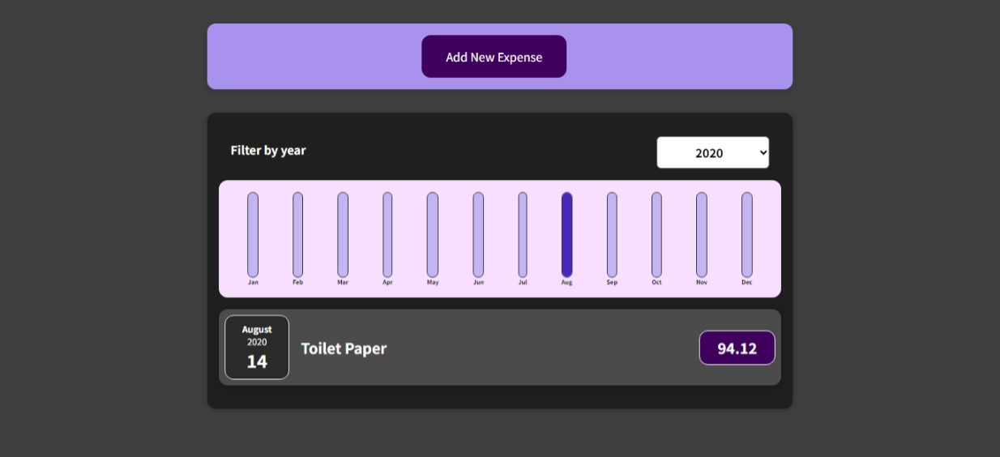
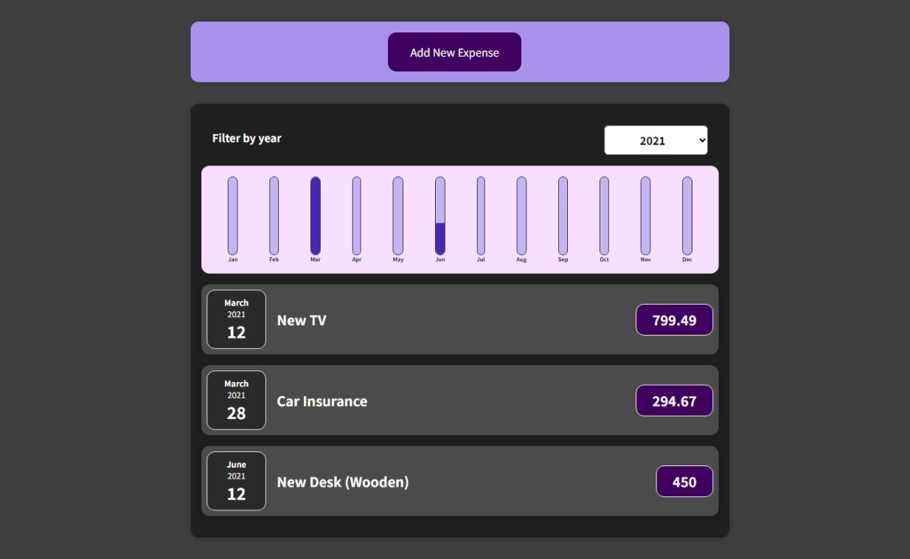
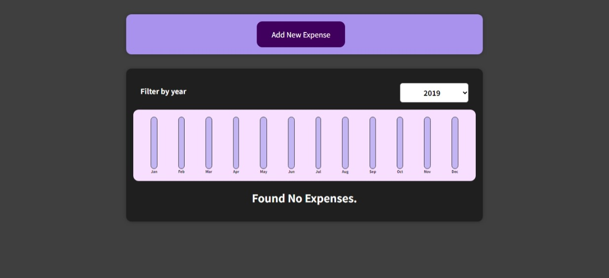

# Expense App

A simple application made with ReactJs to add expenses and filter it year wise while learning ReactJs.

# Built With

- [React.js](https://reactjs.org/) - A JavaScript library for building user interfaces.

# Screenshots

